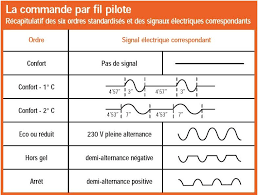

# Connected heater

**This is an ongoing project, do not expect everything to work !**

The architecture of this solution is as follows: a base station is running and parses incoming SMS. Each heater controller connects to the base station regularly and requests the current heater state.

## Base station

The base station is responsible for parsing incoming SMS that contains commands. It then keeps track of the heater state (off, eco, defrost...) and responds to requests.
It is based on a Raspberry Pi connected to a SIM5320E for cellular connection.

### Hardware

See `docs/base_station_assembly_guide.md` on how to assemble the base station.

### Software

The software is a daemon running on Linux. It communicates with smstools to send/receive SMS from a 3G module.
See `base_station/README.md` for more information.

## Heater controller (or IOT-heater)

Each electric heater can be controlled by sending a SMS to the base station. Heater controllers periodically connect to the base station to retrieve the current heater state.

Electric heaters are controlled by one wire:

See [here](https://www.planete-domotique.com/blog/2012/01/05/piloter-un-radiateur-grace-a-son-fil-pilote/) (in french) for more information on this control wire.

### Hardware

Heater controllers are built around a ESP8266 which controls two solid state relays. A small 220VAC to 5VDC module is used to power the ESP8266.
See Kicad files in folder `hardware` for more information.

See `docs/iot_heater_assembly_guide.md` for more information on how to assemble the heater controller.

### Firmware

The firmware is implemented using Arduino libraries for ESP8266.
See `heater_firmware/README.md` for more information.
